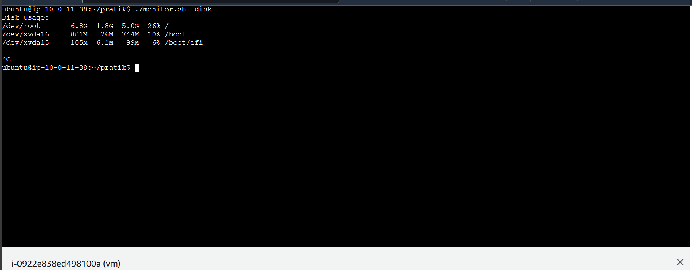

# System Monitoring Script
---


This script provides real-time monitoring of system resources on an Ubuntu server. It displays various metrics, including CPU and memory usage, network statistics, disk usage, system load, memory usage, process details, and service statuses. The dashboard can be refreshed every few seconds and allows users to view specific sections of the dashboard using command-line switches.

## Features

- **Top 10 Applications**: Displays the top 10 applications consuming the most CPU and memory.
- **Network Monitoring**: Shows the number of concurrent connections, packet drops, and network traffic (MB in and out).
- **Disk Usage**: Displays disk space usage by mounted partitions and highlights partitions using more than 80% of disk space.
- **System Load**: Shows the current load average and a breakdown of CPU usage.
- **Memory Usage**: Displays total, used, and free memory, including swap memory usage.
- **Process Monitoring**: Lists the number of active processes and the top 5 processes by CPU and memory usage.
- **Service Monitoring**: Monitors the status of essential services like `sshd`, `nginx`, and `iptables`.

## Installation

To set up the environment on an EC2 Ubuntu instance, follow these steps:

1. **Update Package Lists**:
   ```bash
   sudo apt update
   ```

2. **Install Required Packages**:
   ```bash
   sudo apt install -y net-tools procps sysstat gawk
   ```

3. **Make the Script Executable**:
   - Save the script to a file, e.g., `monitor.sh`.
   - Make it executable with:
     ```bash
     chmod +x monitor.sh
     ```

## Usage

Run the script by executing the following command:

```bash
./monitor.sh
```

The script will display a full dashboard by default. You can also use command-line switches to view specific parts of the dashboard:

- **Display Top 10 Applications**:
  ```bash
  ./monitor.sh -top
  ```

- **Network Monitoring**:
  ```bash
  ./monitor.sh -network
  ```

- **Disk Usage**:
  ```bash
  ./monitor.sh -disk
  ```

- **System Load**:
  ```bash
  ./monitor.sh -load
  ```

- **Memory Usage**:
  ```bash
  ./monitor.sh -memory
  ```

- **Process Monitoring**:
  ```bash
  ./monitor.sh -process
  ```

- **Service Monitoring**:
  ```bash
  ./monitor.sh -services
  ```

## Example Output

When running `./monitor.sh -disk`, you might see:



Partitions with more than 80% disk usage will be highlighted in red.

## Notes

- **Instance Type**: The script can run on a `t2.micro` instance, but monitor CPU and memory usage to ensure it meets your performance needs. If performance issues arise, consider upgrading to a larger instance type.
- **Script Refresh**: The script refreshes data every 5 seconds. Adjust the `sleep` interval in the script if needed.

## Troubleshooting

- **Script Errors**: Ensure all required packages are installed and that the script has execute permissions.
- **Performance Issues**: If running on a `t2.micro` instance, check CPU and memory usage. Consider upgrading the instance if necessary.

---

Feel free to adjust any details as needed to fit your specific use case or preferences.
